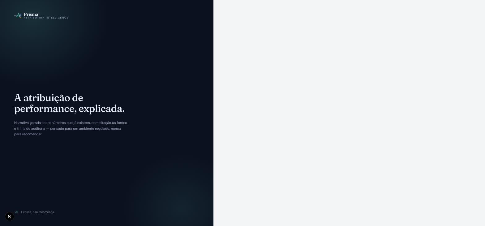
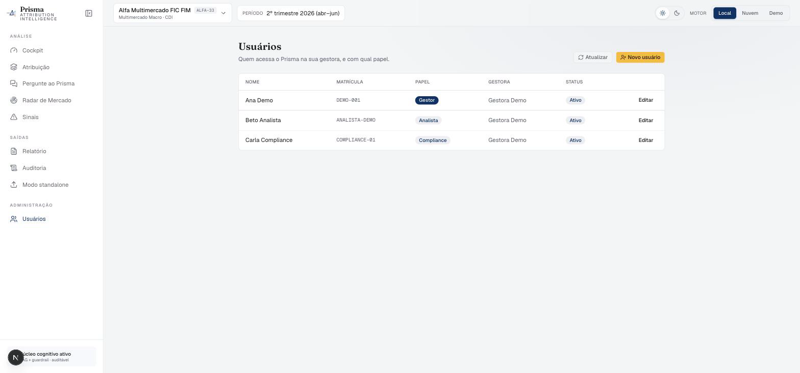

# Prisma — Attribution Intelligence

[](https://github.com/fabioffigueiredo/FinRAG_Prisma/actions/workflows/ci.yml)    %20ou%20API-5eead4) 

**A atribuição de performance, explicada.** O Prisma é uma camada cognitiva que
transforma o resultado da atribuição de performance de fundos em **narrativa
auditável**: explica em linguagem natural de onde veio o retorno, responde
perguntas com **citações às fontes** e registra tudo em **trilha de auditoria** —
podendo rodar **100% local e privado** (Ollama).


> ⚠️ Dados 100% fictícios (fundos "Alfa", "Beta" e "Gama"); nenhuma instituição
> real é citada. Prova de conceito — artefato de demonstração.

## Por que existe

Plataformas de atribuição entregam **números** (contribuição por estratégia/ativo
vs benchmark). A tradução em **comentário de fundo** — o texto que vai a gestor,
comitê e cliente — ainda é manual, lenta e sem trilha. O Prisma fecha esse vão:

- **Narrativa gerada** sobre números que já existem (baixo risco de alucinação);
- **Q&A fundamentado** (RAG) com citações e score de recuperação;
- **Radar de Mercado**: notícias classificadas por sentimento dão o "porquê";
- **Pergunte ao Prisma conectado a Sinais de Mercado**: o copiloto conversacional
  chama o mesmo modelo de regras auditável do Radar/Sinais (nível, probabilidade,
  evidência por notícia, aviso legal CVM 20) — "qual a indicação de mercado para
  esse fundo?" puxa o sinal de verdade, não uma narrativa genérica reaproveitada;
  quando a resposta vem do motor Demo (sem LLM real conectado), um aviso visível
  no chat e um registro na trilha de auditoria deixam isso explícito, nunca
  silencioso;
- **Guardrails**: prompt-injection bloqueado + escopo anti-recomendação
  ("explica, não recomenda", cobrindo fraseado coloquial — "vale a pena
  resgatar?", "compensa sair?") — postura pensada para ambiente regulado;
- **Auditoria**: cada consulta registrada (fontes, motor, latência, hash);
- **Conta e acesso nos padrões de instituição financeira**: login com lockout
  e rate limiting, 2FA (TOTP) obrigatório para gestor/compliance — com troca
  de dispositivo self-service via step-up de senha —, sessão revogável a
  qualquer momento pelo admin, e trilha de auditoria de login/logout/CRUD de
  usuário — ver [`docs/SEGURANCA.md`](docs/SEGURANCA.md).
- **Cadastro e ativação de conta**: autocadastro público com aprovação de um
  gestor, ou convite direto — os dois convergem num link de ativação de uso
  único (nunca senha por e-mail, padrão OWASP Forgot Password Cheat Sheet).

**Um núcleo, dois adaptadores:** integrado (consome a API da plataforma de
atribuição do cliente) ou standalone (ingere exports CSV).

| Radar de Mercado | Auditoria |
|---|---|
|  |  |

| Login | Painel de usuários (admin) |
|---|---|
|  |  |

## Arquitetura

```
apps/web/              Next.js 16 + Tailwind v4 (Base UI) — o dashboard
apps/web/.../login/            tela de login (cookie httpOnly + CSRF)
apps/web/.../admin/usuarios/   painel de usuários — só gestor/compliance
services/prisma-api/   FastAPI — RAG + guardrails (núcleo finrag vendorizado)
services/prisma-api/finrag/   retrieval FAISS, chunking, guardrails, LLM clients
data/corpus/           regras de atribuição (corpus RAG, indexado com bge-m3)
data/seed/             3 fundos-exemplo + notícias classificadas (sentimento)
scripts/               classificação offline de notícias (pipeline TF-IDF+SVM)
docs/                  deck de pitch (HTML), arquitetura, riscos, negócio, segurança
```

**A IA é flexível — local ou via chave de API.** Três backends selecionáveis na UI:
- **Local (Ollama)** — `llama3.1:8b` + embeddings `bge-m3:567m` · 100% privado/offline;
- **Nuvem (Groq)** — `llama-3.1-8b-instant` · baixa latência (basta `GROQ_API_KEY`);
- **Demo (mock)** — determinístico, roda sem nada.

O backend é pluggável (`get_llm`): qualquer endpoint OpenAI-compatível entra com
poucas linhas — incluindo o modelo homologado do seu ambiente corporativo.

## 🎥 Tutorial em vídeo

[](https://www.youtube.com/watch?v=AXIaKuO7Yrc)

Passo a passo de todas as telas (~2 min) — clique na imagem para assistir no YouTube.

## 📐 Qualidade & governança

- **Recuperação (RAG):** Hit@4 = 100% · MRR 0,48 sobre golden queries do domínio —
  ver [`docs/METRICAS_RAG.md`](docs/METRICAS_RAG.md) (reproduza: `python scripts/avaliar_rag.py`).
- **Governança de IA** (escopo, aprovação humana, auditoria, CVM): [`docs/GOVERNANCA_IA.md`](docs/GOVERNANCA_IA.md).
- **Segurança** (autenticação, sessão, 2FA, auditoria, padrões BACEN 85/2021 + OWASP ASVS): [`docs/SEGURANCA.md`](docs/SEGURANCA.md).
- **Sinais** de apoio à decisão (probabilísticos, auditáveis, nunca recomendação):
  [`docs/GOVERNANCA_IA.md`](docs/GOVERNANCA_IA.md) §3.

## Como rodar

**Pré-requisitos:** Node 22 + pnpm; Python 3.12 + [uv](https://docs.astral.sh/uv/);
[Ollama](https://ollama.com) com `ollama pull llama3.1:8b` e `ollama pull bge-m3:567m`;
Docker (Postgres de dev — necessário pro login/admin, ver abaixo).

```bash
# 0. Dependências
uv venv .venv --python 3.12 && VIRTUAL_ENV=$PWD/.venv uv pip install -r requirements.txt
cd apps/web && pnpm install && cd ../..

# 0.1 Postgres de dev (login, admin de usuários, auditoria) + segredo do JWT
docker compose -f docker-compose.dev.yml up -d
export PRISMA_JWT_SECRET="$(openssl rand -hex 32)"   # obrigatório com PRISMA_ENV=production; em dev cai num default inseguro se omitido
# export PRISMA_DEMO_MATRICULA="DEMO-MS"             # opcional — matrícula da conta demo do botão "Entrar com Microsoft" (simulação, ver docs/SEGURANCA.md)
cd services/prisma-api && ../../.venv/bin/python -m alembic upgrade head && cd ../..

# 1. API (porta 8000) — indexa o corpus com bge-m3 e pré-aquece o modelo
cd services/prisma-api && ../../.venv/bin/python -m uvicorn app:app --port 8000

# 2. Frontend (porta 3100)
cd apps/web && ./node_modules/.bin/next dev -p 3100   # http://localhost:3100
```

> Sem a API no ar, o frontend usa dados-exemplo (fallback) e a demo ainda funciona.
> Sem Ollama, a API cai para embeddings sentence-transformers e o motor "Demo".
> Sem Postgres, narrativa/copiloto/radar continuam funcionando (fallback), mas
> **login e o painel de usuários exigem banco** — não há modo demo pra auth.
> Reclassificar as notícias do radar (opcional):
> `pip install -r scripts/finnlp_pipeline/requirements-finnlp.txt` e
> `.venv/bin/python scripts/classificar_noticias.py --llm`

**Testes:** `cd services/prisma-api && ../../.venv/bin/python -m pytest tests/ -v`
(232 testes, 226 passam/6 skip, banco `prisma_test` — ver `docker-compose.dev.yml`) ·
`cd apps/web && ./node_modules/.bin/vitest run` (11 testes) ·
`cd apps/web && ./node_modules/.bin/tsc --noEmit`

## Roteiro de demo (~5 min)
1. **Cockpit** — números + Radar de Mercado + "Gerar ao vivo" (narrativa local).
2. **Atribuição** — waterfall + drill por estratégia.
3. **Copiloto** — pergunta fundamentada; "Por que o varejo pesou?" cita notícia;
   botão "Sinais de Mercado" puxa o alerta probabilístico com aviso legal CVM 20.
4. **Guardrails** — injeção bloqueada + "vale a pena resgatar agora?" recusado
   (escopo, inclusive fraseado coloquial).
5. **Multi-fundo** — trocar para Beta Ações no seletor; "Compare o Alfa e o Beta".
6. **Auditoria** — mostrar a trilha das consultas feitas na própria demo,
   incluindo se a resposta veio do motor real ou do modo degradado.
7. **Motor** — alternar Local ↔ Nuvem (privacidade vs latência).

## Deck
`docs/deck/index.html` — abrir no navegador; setas ← → para navegar (12 slides).

## Linhagem
Evolução de dois projetos do mesmo autor: **FinNLP** (NLP clássico: sentimento,
NER, grafo de entidades) e **FinRAG** (RAG com guardrails e citações). O Prisma
os integra numa camada de produto sobre atribuição de performance.
