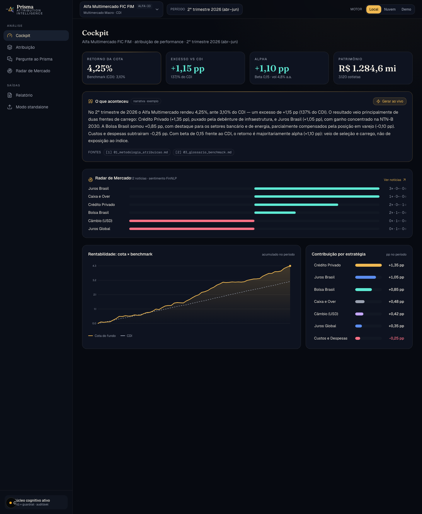
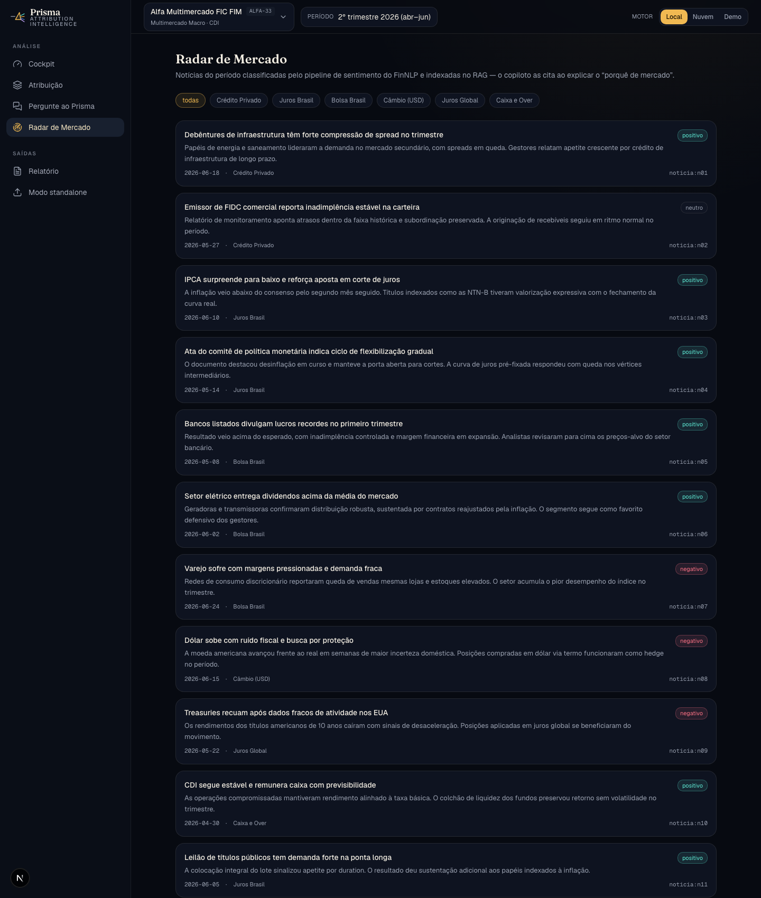
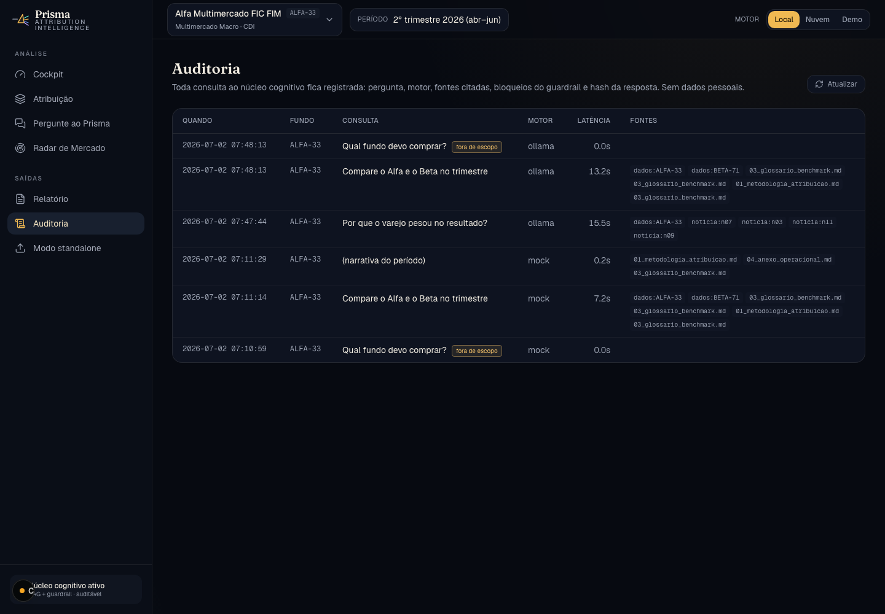

# Prisma — Attribution Intelligence

**A atribuição de performance, explicada.** O Prisma é uma camada cognitiva que
transforma o resultado da atribuição de performance de fundos em **narrativa
auditável**: explica em linguagem natural de onde veio o retorno, responde
perguntas com **citações às fontes** e registra tudo em **trilha de auditoria** —
podendo rodar **100% local e privado** (Ollama).



> ⚠️ Dados 100% fictícios (fundos "Alfa", "Beta" e "Gama"); nenhuma instituição
> real é citada. Prova de conceito — artefato de demonstração.

## Por que existe

Plataformas de atribuição entregam **números** (contribuição por estratégia/ativo
vs benchmark). A tradução em **comentário de fundo** — o texto que vai a gestor,
comitê e cliente — ainda é manual, lenta e sem trilha. O Prisma fecha esse vão:

- **Narrativa gerada** sobre números que já existem (baixo risco de alucinação);
- **Q&A fundamentado** (RAG) com citações e score de recuperação;
- **Radar de Mercado**: notícias classificadas por sentimento dão o "porquê";
- **Guardrails**: prompt-injection bloqueado + escopo anti-recomendação
  ("explica, não recomenda") — postura pensada para ambiente regulado;
- **Auditoria**: cada consulta registrada (fontes, motor, latência, hash).

**Um núcleo, dois adaptadores:** integrado (consome a API da plataforma de
atribuição do cliente) ou standalone (ingere exports CSV).

| Radar de Mercado | Auditoria |
|---|---|
|  |  |

## Arquitetura

```
apps/web/              Next.js 16 + Tailwind v4 (Base UI) — o dashboard
services/prisma-api/   FastAPI — RAG + guardrails (núcleo finrag vendorizado)
services/prisma-api/finrag/   retrieval FAISS, chunking, guardrails, LLM clients
data/corpus/           regras de atribuição (corpus RAG, indexado com bge-m3)
data/seed/             3 fundos-exemplo + notícias classificadas (sentimento)
scripts/               classificação offline de notícias (pipeline TF-IDF+SVM)
docs/                  deck de pitch (HTML), arquitetura, riscos, negócio
marketing/             kit de divulgação (LinkedIn, vídeos, apresentações)
```

Três backends de LLM selecionáveis na UI:
- **Local (Ollama)** — `llama3.1:8b` + embeddings `bge-m3:567m` · privado/offline;
- **Nuvem (Groq)** — `llama-3.1-8b-instant` · baixa latência (requer `GROQ_API_KEY`);
- **Demo (mock)** — determinístico, roda sem nada.

## Como rodar

**Pré-requisitos:** Node 22 + pnpm; Python 3.12 + [uv](https://docs.astral.sh/uv/);
[Ollama](https://ollama.com) com `ollama pull llama3.1:8b` e `ollama pull bge-m3:567m`.

```bash
# 0. Dependências
uv venv .venv --python 3.12 && VIRTUAL_ENV=$PWD/.venv uv pip install -r requirements.txt
cd apps/web && pnpm install && cd ../..

# 1. API (porta 8000) — indexa o corpus com bge-m3 e pré-aquece o modelo
cd services/prisma-api && ../../.venv/bin/python -m uvicorn app:app --port 8000

# 2. Frontend (porta 3100)
cd apps/web && ./node_modules/.bin/next dev -p 3100   # http://localhost:3100
```

> Sem a API no ar, o frontend usa dados-exemplo (fallback) e a demo ainda funciona.
> Sem Ollama, a API cai para embeddings sentence-transformers e o motor "Demo".
> Reclassificar as notícias do radar (opcional):
> `pip install -r scripts/finnlp_pipeline/requirements-finnlp.txt` e
> `.venv/bin/python scripts/classificar_noticias.py --llm`

**Testes:** `cd services/prisma-api && ../../.venv/bin/python -m pytest tests/ -v`
(13 testes) · `cd apps/web && ./node_modules/.bin/tsc --noEmit`

## Roteiro de demo (~5 min)
1. **Cockpit** — números + Radar de Mercado + "Gerar ao vivo" (narrativa local).
2. **Atribuição** — waterfall + drill por estratégia.
3. **Copiloto** — pergunta fundamentada; "Por que o varejo pesou?" cita notícia.
4. **Guardrails** — injeção bloqueada + "Qual fundo devo comprar?" recusado (escopo).
5. **Multi-fundo** — trocar para Beta Ações no seletor; "Compare o Alfa e o Beta".
6. **Auditoria** — mostrar a trilha das consultas feitas na própria demo.
7. **Motor** — alternar Local ↔ Nuvem (privacidade vs latência).

## Deck
`docs/deck/index.html` — abrir no navegador; setas ← → para navegar (12 slides).

## Linhagem
Evolução de dois projetos do mesmo autor: **FinNLP** (NLP clássico: sentimento,
NER, grafo de entidades) e **FinRAG** (RAG com guardrails e citações). O Prisma
os integra numa camada de produto sobre atribuição de performance.
